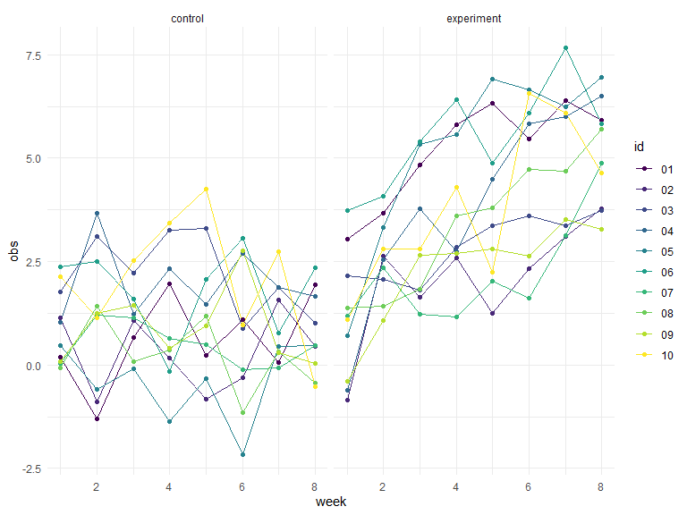

p8105\_hw5\_kpc2124
================
Kristi Chau
11/1/2019


## Problem 1 - iris dataset

Write a function that takes a vector as an argument; replaces missing
values using the rules defined; and returns the resulting vector. Apply
this function to the columns of iris\_with\_missing using a map
statement.

``` r
set.seed(10)

iris_with_missing = iris %>% 
  map_df(~replace(.x, sample(1:150, 20), NA)) %>%
  mutate(Species = as.character(Species))
```

Rules:

  - For numeric variables, you should fill in missing values with the
    mean of non-missing values

  - For character variables, you should fill in missing values with
    “virginica”

<!-- end list -->

``` r
iris_na = function(c) {
  ## if the column contains numeric variables, replace NAs with the row mean
  if (is.numeric(c)) {
    replace_na(c, round(mean(c, na.rm = TRUE),2))
  }
  ## if the column contains character variables, replace NAs with virginica
  else if (is.character(c)) {
    replace_na(c, "virginica")
  }
}

## mapping the function to the iris_with_missing
iris_full = 
  map(iris_with_missing,iris_na) %>% 
  bind_cols()

## plotted as a table for readibility and to see that all NAs have been replaced
iris_full %>% 
  kable()
```

<table>

<thead>

<tr>

<th style="text-align:right;">

Sepal.Length

</th>

<th style="text-align:right;">

Sepal.Width

</th>

<th style="text-align:right;">

Petal.Length

</th>

<th style="text-align:right;">

Petal.Width

</th>

<th style="text-align:left;">

Species

</th>

</tr>

</thead>

<tbody>

<tr>

<td style="text-align:right;">

5.10

</td>

<td style="text-align:right;">

3.50

</td>

<td style="text-align:right;">

1.40

</td>

<td style="text-align:right;">

0.20

</td>

<td style="text-align:left;">

setosa

</td>

</tr>

<tr>

<td style="text-align:right;">

4.90

</td>

<td style="text-align:right;">

3.00

</td>

<td style="text-align:right;">

1.40

</td>

<td style="text-align:right;">

0.20

</td>

<td style="text-align:left;">

setosa

</td>

</tr>

<tr>

<td style="text-align:right;">

4.70

</td>

<td style="text-align:right;">

3.20

</td>

<td style="text-align:right;">

1.30

</td>

<td style="text-align:right;">

0.20

</td>

<td style="text-align:left;">

setosa

</td>

</tr>

<tr>

<td style="text-align:right;">

4.60

</td>

<td style="text-align:right;">

3.10

</td>

<td style="text-align:right;">

1.50

</td>

<td style="text-align:right;">

1.19

</td>

<td style="text-align:left;">

setosa

</td>

</tr>

<tr>

<td style="text-align:right;">

5.00

</td>

<td style="text-align:right;">

3.60

</td>

<td style="text-align:right;">

1.40

</td>

<td style="text-align:right;">

0.20

</td>

<td style="text-align:left;">

setosa

</td>

</tr>

<tr>

<td style="text-align:right;">

5.40

</td>

<td style="text-align:right;">

3.90

</td>

<td style="text-align:right;">

1.70

</td>

<td style="text-align:right;">

0.40

</td>

<td style="text-align:left;">

setosa

</td>

</tr>

<tr>

<td style="text-align:right;">

5.82

</td>

<td style="text-align:right;">

3.40

</td>

<td style="text-align:right;">

1.40

</td>

<td style="text-align:right;">

0.30

</td>

<td style="text-align:left;">

setosa

</td>

</tr>

<tr>

<td style="text-align:right;">

5.00

</td>

<td style="text-align:right;">

3.40

</td>

<td style="text-align:right;">

1.50

</td>

<td style="text-align:right;">

0.20

</td>

<td style="text-align:left;">

setosa

</td>

</tr>

<tr>

<td style="text-align:right;">

4.40

</td>

<td style="text-align:right;">

2.90

</td>

<td style="text-align:right;">

1.40

</td>

<td style="text-align:right;">

0.20

</td>

<td style="text-align:left;">

setosa

</td>

</tr>

<tr>

<td style="text-align:right;">

4.90

</td>

<td style="text-align:right;">

3.10

</td>

<td style="text-align:right;">

3.77

</td>

<td style="text-align:right;">

0.10

</td>

<td style="text-align:left;">

setosa

</td>

</tr>

<tr>

<td style="text-align:right;">

5.40

</td>

<td style="text-align:right;">

3.08

</td>

<td style="text-align:right;">

1.50

</td>

<td style="text-align:right;">

0.20

</td>

<td style="text-align:left;">

setosa

</td>

</tr>

<tr>

<td style="text-align:right;">

4.80

</td>

<td style="text-align:right;">

3.40

</td>

<td style="text-align:right;">

1.60

</td>

<td style="text-align:right;">

0.20

</td>

<td style="text-align:left;">

setosa

</td>

</tr>

<tr>

<td style="text-align:right;">

5.82

</td>

<td style="text-align:right;">

3.08

</td>

<td style="text-align:right;">

1.40

</td>

<td style="text-align:right;">

0.10

</td>

<td style="text-align:left;">

setosa

</td>

</tr>

<tr>

<td style="text-align:right;">

4.30

</td>

<td style="text-align:right;">

3.00

</td>

<td style="text-align:right;">

3.77

</td>

<td style="text-align:right;">

0.10

</td>

<td style="text-align:left;">

setosa

</td>

</tr>

<tr>

<td style="text-align:right;">

5.82

</td>

<td style="text-align:right;">

4.00

</td>

<td style="text-align:right;">

3.77

</td>

<td style="text-align:right;">

0.20

</td>

<td style="text-align:left;">

setosa

</td>

</tr>

<tr>

<td style="text-align:right;">

5.70

</td>

<td style="text-align:right;">

4.40

</td>

<td style="text-align:right;">

1.50

</td>

<td style="text-align:right;">

0.40

</td>

<td style="text-align:left;">

setosa

</td>

</tr>

<tr>

<td style="text-align:right;">

5.40

</td>

<td style="text-align:right;">

3.90

</td>

<td style="text-align:right;">

1.30

</td>

<td style="text-align:right;">

0.40

</td>

<td style="text-align:left;">

setosa

</td>

</tr>

<tr>

<td style="text-align:right;">

5.10

</td>

<td style="text-align:right;">

3.50

</td>

<td style="text-align:right;">

1.40

</td>

<td style="text-align:right;">

1.19

</td>

<td style="text-align:left;">

setosa

</td>

</tr>

<tr>

<td style="text-align:right;">

5.70

</td>

<td style="text-align:right;">

3.80

</td>

<td style="text-align:right;">

1.70

</td>

<td style="text-align:right;">

0.30

</td>

<td style="text-align:left;">

setosa

</td>

</tr>

<tr>

<td style="text-align:right;">

5.10

</td>

<td style="text-align:right;">

3.80

</td>

<td style="text-align:right;">

1.50

</td>

<td style="text-align:right;">

1.19

</td>

<td style="text-align:left;">

setosa

</td>

</tr>

<tr>

<td style="text-align:right;">

5.40

</td>

<td style="text-align:right;">

3.40

</td>

<td style="text-align:right;">

1.70

</td>

<td style="text-align:right;">

0.20

</td>

<td style="text-align:left;">

setosa

</td>

</tr>

<tr>

<td style="text-align:right;">

5.10

</td>

<td style="text-align:right;">

3.70

</td>

<td style="text-align:right;">

1.50

</td>

<td style="text-align:right;">

0.40

</td>

<td style="text-align:left;">

virginica

</td>

</tr>

<tr>

<td style="text-align:right;">

4.60

</td>

<td style="text-align:right;">

3.60

</td>

<td style="text-align:right;">

1.00

</td>

<td style="text-align:right;">

0.20

</td>

<td style="text-align:left;">

setosa

</td>

</tr>

<tr>

<td style="text-align:right;">

5.82

</td>

<td style="text-align:right;">

3.30

</td>

<td style="text-align:right;">

3.77

</td>

<td style="text-align:right;">

0.50

</td>

<td style="text-align:left;">

setosa

</td>

</tr>

<tr>

<td style="text-align:right;">

4.80

</td>

<td style="text-align:right;">

3.40

</td>

<td style="text-align:right;">

1.90

</td>

<td style="text-align:right;">

0.20

</td>

<td style="text-align:left;">

virginica

</td>

</tr>

<tr>

<td style="text-align:right;">

5.00

</td>

<td style="text-align:right;">

3.00

</td>

<td style="text-align:right;">

3.77

</td>

<td style="text-align:right;">

0.20

</td>

<td style="text-align:left;">

setosa

</td>

</tr>

<tr>

<td style="text-align:right;">

5.00

</td>

<td style="text-align:right;">

3.40

</td>

<td style="text-align:right;">

1.60

</td>

<td style="text-align:right;">

0.40

</td>

<td style="text-align:left;">

virginica

</td>

</tr>

<tr>

<td style="text-align:right;">

5.20

</td>

<td style="text-align:right;">

3.50

</td>

<td style="text-align:right;">

1.50

</td>

<td style="text-align:right;">

0.20

</td>

<td style="text-align:left;">

setosa

</td>

</tr>

<tr>

<td style="text-align:right;">

5.82

</td>

<td style="text-align:right;">

3.40

</td>

<td style="text-align:right;">

1.40

</td>

<td style="text-align:right;">

0.20

</td>

<td style="text-align:left;">

setosa

</td>

</tr>

<tr>

<td style="text-align:right;">

4.70

</td>

<td style="text-align:right;">

3.20

</td>

<td style="text-align:right;">

1.60

</td>

<td style="text-align:right;">

0.20

</td>

<td style="text-align:left;">

setosa

</td>

</tr>

<tr>

<td style="text-align:right;">

4.80

</td>

<td style="text-align:right;">

3.10

</td>

<td style="text-align:right;">

3.77

</td>

<td style="text-align:right;">

0.20

</td>

<td style="text-align:left;">

setosa

</td>

</tr>

<tr>

<td style="text-align:right;">

5.40

</td>

<td style="text-align:right;">

3.08

</td>

<td style="text-align:right;">

1.50

</td>

<td style="text-align:right;">

0.40

</td>

<td style="text-align:left;">

setosa

</td>

</tr>

<tr>

<td style="text-align:right;">

5.20

</td>

<td style="text-align:right;">

3.08

</td>

<td style="text-align:right;">

1.50

</td>

<td style="text-align:right;">

0.10

</td>

<td style="text-align:left;">

setosa

</td>

</tr>

<tr>

<td style="text-align:right;">

5.50

</td>

<td style="text-align:right;">

4.20

</td>

<td style="text-align:right;">

1.40

</td>

<td style="text-align:right;">

0.20

</td>

<td style="text-align:left;">

setosa

</td>

</tr>

<tr>

<td style="text-align:right;">

4.90

</td>

<td style="text-align:right;">

3.10

</td>

<td style="text-align:right;">

3.77

</td>

<td style="text-align:right;">

0.20

</td>

<td style="text-align:left;">

setosa

</td>

</tr>

<tr>

<td style="text-align:right;">

5.00

</td>

<td style="text-align:right;">

3.20

</td>

<td style="text-align:right;">

1.20

</td>

<td style="text-align:right;">

0.20

</td>

<td style="text-align:left;">

setosa

</td>

</tr>

<tr>

<td style="text-align:right;">

5.50

</td>

<td style="text-align:right;">

3.50

</td>

<td style="text-align:right;">

1.30

</td>

<td style="text-align:right;">

0.20

</td>

<td style="text-align:left;">

setosa

</td>

</tr>

<tr>

<td style="text-align:right;">

4.90

</td>

<td style="text-align:right;">

3.60

</td>

<td style="text-align:right;">

1.40

</td>

<td style="text-align:right;">

0.10

</td>

<td style="text-align:left;">

setosa

</td>

</tr>

<tr>

<td style="text-align:right;">

4.40

</td>

<td style="text-align:right;">

3.00

</td>

<td style="text-align:right;">

1.30

</td>

<td style="text-align:right;">

1.19

</td>

<td style="text-align:left;">

setosa

</td>

</tr>

<tr>

<td style="text-align:right;">

5.10

</td>

<td style="text-align:right;">

3.40

</td>

<td style="text-align:right;">

1.50

</td>

<td style="text-align:right;">

0.20

</td>

<td style="text-align:left;">

setosa

</td>

</tr>

<tr>

<td style="text-align:right;">

5.00

</td>

<td style="text-align:right;">

3.50

</td>

<td style="text-align:right;">

1.30

</td>

<td style="text-align:right;">

0.30

</td>

<td style="text-align:left;">

setosa

</td>

</tr>

<tr>

<td style="text-align:right;">

4.50

</td>

<td style="text-align:right;">

3.08

</td>

<td style="text-align:right;">

1.30

</td>

<td style="text-align:right;">

1.19

</td>

<td style="text-align:left;">

virginica

</td>

</tr>

<tr>

<td style="text-align:right;">

4.40

</td>

<td style="text-align:right;">

3.20

</td>

<td style="text-align:right;">

1.30

</td>

<td style="text-align:right;">

0.20

</td>

<td style="text-align:left;">

setosa

</td>

</tr>

<tr>

<td style="text-align:right;">

5.00

</td>

<td style="text-align:right;">

3.50

</td>

<td style="text-align:right;">

1.60

</td>

<td style="text-align:right;">

0.60

</td>

<td style="text-align:left;">

setosa

</td>

</tr>

<tr>

<td style="text-align:right;">

5.10

</td>

<td style="text-align:right;">

3.80

</td>

<td style="text-align:right;">

1.90

</td>

<td style="text-align:right;">

0.40

</td>

<td style="text-align:left;">

setosa

</td>

</tr>

<tr>

<td style="text-align:right;">

4.80

</td>

<td style="text-align:right;">

3.00

</td>

<td style="text-align:right;">

1.40

</td>

<td style="text-align:right;">

0.30

</td>

<td style="text-align:left;">

virginica

</td>

</tr>

<tr>

<td style="text-align:right;">

5.10

</td>

<td style="text-align:right;">

3.80

</td>

<td style="text-align:right;">

1.60

</td>

<td style="text-align:right;">

0.20

</td>

<td style="text-align:left;">

setosa

</td>

</tr>

<tr>

<td style="text-align:right;">

4.60

</td>

<td style="text-align:right;">

3.20

</td>

<td style="text-align:right;">

3.77

</td>

<td style="text-align:right;">

0.20

</td>

<td style="text-align:left;">

setosa

</td>

</tr>

<tr>

<td style="text-align:right;">

5.30

</td>

<td style="text-align:right;">

3.70

</td>

<td style="text-align:right;">

1.50

</td>

<td style="text-align:right;">

0.20

</td>

<td style="text-align:left;">

setosa

</td>

</tr>

<tr>

<td style="text-align:right;">

5.00

</td>

<td style="text-align:right;">

3.08

</td>

<td style="text-align:right;">

1.40

</td>

<td style="text-align:right;">

0.20

</td>

<td style="text-align:left;">

setosa

</td>

</tr>

<tr>

<td style="text-align:right;">

7.00

</td>

<td style="text-align:right;">

3.08

</td>

<td style="text-align:right;">

4.70

</td>

<td style="text-align:right;">

1.40

</td>

<td style="text-align:left;">

virginica

</td>

</tr>

<tr>

<td style="text-align:right;">

6.40

</td>

<td style="text-align:right;">

3.20

</td>

<td style="text-align:right;">

4.50

</td>

<td style="text-align:right;">

1.50

</td>

<td style="text-align:left;">

versicolor

</td>

</tr>

<tr>

<td style="text-align:right;">

6.90

</td>

<td style="text-align:right;">

3.10

</td>

<td style="text-align:right;">

4.90

</td>

<td style="text-align:right;">

1.50

</td>

<td style="text-align:left;">

versicolor

</td>

</tr>

<tr>

<td style="text-align:right;">

5.50

</td>

<td style="text-align:right;">

2.30

</td>

<td style="text-align:right;">

4.00

</td>

<td style="text-align:right;">

1.30

</td>

<td style="text-align:left;">

versicolor

</td>

</tr>

<tr>

<td style="text-align:right;">

6.50

</td>

<td style="text-align:right;">

2.80

</td>

<td style="text-align:right;">

4.60

</td>

<td style="text-align:right;">

1.50

</td>

<td style="text-align:left;">

versicolor

</td>

</tr>

<tr>

<td style="text-align:right;">

5.70

</td>

<td style="text-align:right;">

2.80

</td>

<td style="text-align:right;">

4.50

</td>

<td style="text-align:right;">

1.30

</td>

<td style="text-align:left;">

versicolor

</td>

</tr>

<tr>

<td style="text-align:right;">

6.30

</td>

<td style="text-align:right;">

3.30

</td>

<td style="text-align:right;">

4.70

</td>

<td style="text-align:right;">

1.60

</td>

<td style="text-align:left;">

virginica

</td>

</tr>

<tr>

<td style="text-align:right;">

4.90

</td>

<td style="text-align:right;">

2.40

</td>

<td style="text-align:right;">

3.77

</td>

<td style="text-align:right;">

1.00

</td>

<td style="text-align:left;">

versicolor

</td>

</tr>

<tr>

<td style="text-align:right;">

6.60

</td>

<td style="text-align:right;">

2.90

</td>

<td style="text-align:right;">

4.60

</td>

<td style="text-align:right;">

1.30

</td>

<td style="text-align:left;">

virginica

</td>

</tr>

<tr>

<td style="text-align:right;">

5.20

</td>

<td style="text-align:right;">

2.70

</td>

<td style="text-align:right;">

3.90

</td>

<td style="text-align:right;">

1.40

</td>

<td style="text-align:left;">

versicolor

</td>

</tr>

<tr>

<td style="text-align:right;">

5.00

</td>

<td style="text-align:right;">

2.00

</td>

<td style="text-align:right;">

3.77

</td>

<td style="text-align:right;">

1.00

</td>

<td style="text-align:left;">

versicolor

</td>

</tr>

<tr>

<td style="text-align:right;">

5.90

</td>

<td style="text-align:right;">

3.00

</td>

<td style="text-align:right;">

4.20

</td>

<td style="text-align:right;">

1.50

</td>

<td style="text-align:left;">

versicolor

</td>

</tr>

<tr>

<td style="text-align:right;">

6.00

</td>

<td style="text-align:right;">

2.20

</td>

<td style="text-align:right;">

4.00

</td>

<td style="text-align:right;">

1.19

</td>

<td style="text-align:left;">

versicolor

</td>

</tr>

<tr>

<td style="text-align:right;">

6.10

</td>

<td style="text-align:right;">

2.90

</td>

<td style="text-align:right;">

4.70

</td>

<td style="text-align:right;">

1.40

</td>

<td style="text-align:left;">

versicolor

</td>

</tr>

<tr>

<td style="text-align:right;">

5.60

</td>

<td style="text-align:right;">

2.90

</td>

<td style="text-align:right;">

3.60

</td>

<td style="text-align:right;">

1.30

</td>

<td style="text-align:left;">

versicolor

</td>

</tr>

<tr>

<td style="text-align:right;">

6.70

</td>

<td style="text-align:right;">

3.10

</td>

<td style="text-align:right;">

4.40

</td>

<td style="text-align:right;">

1.40

</td>

<td style="text-align:left;">

versicolor

</td>

</tr>

<tr>

<td style="text-align:right;">

5.60

</td>

<td style="text-align:right;">

3.00

</td>

<td style="text-align:right;">

4.50

</td>

<td style="text-align:right;">

1.50

</td>

<td style="text-align:left;">

versicolor

</td>

</tr>

<tr>

<td style="text-align:right;">

5.80

</td>

<td style="text-align:right;">

3.08

</td>

<td style="text-align:right;">

4.10

</td>

<td style="text-align:right;">

1.00

</td>

<td style="text-align:left;">

versicolor

</td>

</tr>

<tr>

<td style="text-align:right;">

6.20

</td>

<td style="text-align:right;">

2.20

</td>

<td style="text-align:right;">

4.50

</td>

<td style="text-align:right;">

1.50

</td>

<td style="text-align:left;">

versicolor

</td>

</tr>

<tr>

<td style="text-align:right;">

5.60

</td>

<td style="text-align:right;">

2.50

</td>

<td style="text-align:right;">

3.90

</td>

<td style="text-align:right;">

1.10

</td>

<td style="text-align:left;">

versicolor

</td>

</tr>

<tr>

<td style="text-align:right;">

5.90

</td>

<td style="text-align:right;">

3.20

</td>

<td style="text-align:right;">

4.80

</td>

<td style="text-align:right;">

1.80

</td>

<td style="text-align:left;">

versicolor

</td>

</tr>

<tr>

<td style="text-align:right;">

5.82

</td>

<td style="text-align:right;">

2.80

</td>

<td style="text-align:right;">

4.00

</td>

<td style="text-align:right;">

1.30

</td>

<td style="text-align:left;">

virginica

</td>

</tr>

<tr>

<td style="text-align:right;">

6.30

</td>

<td style="text-align:right;">

2.50

</td>

<td style="text-align:right;">

4.90

</td>

<td style="text-align:right;">

1.50

</td>

<td style="text-align:left;">

versicolor

</td>

</tr>

<tr>

<td style="text-align:right;">

5.82

</td>

<td style="text-align:right;">

2.80

</td>

<td style="text-align:right;">

3.77

</td>

<td style="text-align:right;">

1.20

</td>

<td style="text-align:left;">

versicolor

</td>

</tr>

<tr>

<td style="text-align:right;">

6.40

</td>

<td style="text-align:right;">

2.90

</td>

<td style="text-align:right;">

4.30

</td>

<td style="text-align:right;">

1.30

</td>

<td style="text-align:left;">

versicolor

</td>

</tr>

<tr>

<td style="text-align:right;">

6.60

</td>

<td style="text-align:right;">

3.00

</td>

<td style="text-align:right;">

4.40

</td>

<td style="text-align:right;">

1.40

</td>

<td style="text-align:left;">

versicolor

</td>

</tr>

<tr>

<td style="text-align:right;">

6.80

</td>

<td style="text-align:right;">

2.80

</td>

<td style="text-align:right;">

4.80

</td>

<td style="text-align:right;">

1.40

</td>

<td style="text-align:left;">

versicolor

</td>

</tr>

<tr>

<td style="text-align:right;">

6.70

</td>

<td style="text-align:right;">

3.08

</td>

<td style="text-align:right;">

5.00

</td>

<td style="text-align:right;">

1.19

</td>

<td style="text-align:left;">

versicolor

</td>

</tr>

<tr>

<td style="text-align:right;">

6.00

</td>

<td style="text-align:right;">

3.08

</td>

<td style="text-align:right;">

4.50

</td>

<td style="text-align:right;">

1.19

</td>

<td style="text-align:left;">

versicolor

</td>

</tr>

<tr>

<td style="text-align:right;">

5.70

</td>

<td style="text-align:right;">

2.60

</td>

<td style="text-align:right;">

3.50

</td>

<td style="text-align:right;">

1.00

</td>

<td style="text-align:left;">

virginica

</td>

</tr>

<tr>

<td style="text-align:right;">

5.50

</td>

<td style="text-align:right;">

2.40

</td>

<td style="text-align:right;">

3.80

</td>

<td style="text-align:right;">

1.10

</td>

<td style="text-align:left;">

versicolor

</td>

</tr>

<tr>

<td style="text-align:right;">

5.82

</td>

<td style="text-align:right;">

2.40

</td>

<td style="text-align:right;">

3.70

</td>

<td style="text-align:right;">

1.00

</td>

<td style="text-align:left;">

versicolor

</td>

</tr>

<tr>

<td style="text-align:right;">

5.80

</td>

<td style="text-align:right;">

2.70

</td>

<td style="text-align:right;">

3.90

</td>

<td style="text-align:right;">

1.20

</td>

<td style="text-align:left;">

versicolor

</td>

</tr>

<tr>

<td style="text-align:right;">

6.00

</td>

<td style="text-align:right;">

2.70

</td>

<td style="text-align:right;">

5.10

</td>

<td style="text-align:right;">

1.60

</td>

<td style="text-align:left;">

versicolor

</td>

</tr>

<tr>

<td style="text-align:right;">

5.40

</td>

<td style="text-align:right;">

3.00

</td>

<td style="text-align:right;">

4.50

</td>

<td style="text-align:right;">

1.50

</td>

<td style="text-align:left;">

versicolor

</td>

</tr>

<tr>

<td style="text-align:right;">

5.82

</td>

<td style="text-align:right;">

3.40

</td>

<td style="text-align:right;">

4.50

</td>

<td style="text-align:right;">

1.60

</td>

<td style="text-align:left;">

versicolor

</td>

</tr>

<tr>

<td style="text-align:right;">

6.70

</td>

<td style="text-align:right;">

3.10

</td>

<td style="text-align:right;">

4.70

</td>

<td style="text-align:right;">

1.19

</td>

<td style="text-align:left;">

versicolor

</td>

</tr>

<tr>

<td style="text-align:right;">

5.82

</td>

<td style="text-align:right;">

3.08

</td>

<td style="text-align:right;">

4.40

</td>

<td style="text-align:right;">

1.30

</td>

<td style="text-align:left;">

versicolor

</td>

</tr>

<tr>

<td style="text-align:right;">

5.60

</td>

<td style="text-align:right;">

3.00

</td>

<td style="text-align:right;">

3.77

</td>

<td style="text-align:right;">

1.19

</td>

<td style="text-align:left;">

versicolor

</td>

</tr>

<tr>

<td style="text-align:right;">

5.50

</td>

<td style="text-align:right;">

2.50

</td>

<td style="text-align:right;">

4.00

</td>

<td style="text-align:right;">

1.19

</td>

<td style="text-align:left;">

versicolor

</td>

</tr>

<tr>

<td style="text-align:right;">

5.50

</td>

<td style="text-align:right;">

3.08

</td>

<td style="text-align:right;">

4.40

</td>

<td style="text-align:right;">

1.20

</td>

<td style="text-align:left;">

versicolor

</td>

</tr>

<tr>

<td style="text-align:right;">

5.82

</td>

<td style="text-align:right;">

3.08

</td>

<td style="text-align:right;">

4.60

</td>

<td style="text-align:right;">

1.19

</td>

<td style="text-align:left;">

versicolor

</td>

</tr>

<tr>

<td style="text-align:right;">

5.80

</td>

<td style="text-align:right;">

3.08

</td>

<td style="text-align:right;">

4.00

</td>

<td style="text-align:right;">

1.19

</td>

<td style="text-align:left;">

versicolor

</td>

</tr>

<tr>

<td style="text-align:right;">

5.00

</td>

<td style="text-align:right;">

2.30

</td>

<td style="text-align:right;">

3.30

</td>

<td style="text-align:right;">

1.19

</td>

<td style="text-align:left;">

virginica

</td>

</tr>

<tr>

<td style="text-align:right;">

5.82

</td>

<td style="text-align:right;">

2.70

</td>

<td style="text-align:right;">

4.20

</td>

<td style="text-align:right;">

1.30

</td>

<td style="text-align:left;">

versicolor

</td>

</tr>

<tr>

<td style="text-align:right;">

5.70

</td>

<td style="text-align:right;">

3.00

</td>

<td style="text-align:right;">

4.20

</td>

<td style="text-align:right;">

1.20

</td>

<td style="text-align:left;">

versicolor

</td>

</tr>

<tr>

<td style="text-align:right;">

5.70

</td>

<td style="text-align:right;">

2.90

</td>

<td style="text-align:right;">

4.20

</td>

<td style="text-align:right;">

1.30

</td>

<td style="text-align:left;">

versicolor

</td>

</tr>

<tr>

<td style="text-align:right;">

6.20

</td>

<td style="text-align:right;">

2.90

</td>

<td style="text-align:right;">

4.30

</td>

<td style="text-align:right;">

1.30

</td>

<td style="text-align:left;">

versicolor

</td>

</tr>

<tr>

<td style="text-align:right;">

5.10

</td>

<td style="text-align:right;">

2.50

</td>

<td style="text-align:right;">

3.00

</td>

<td style="text-align:right;">

1.19

</td>

<td style="text-align:left;">

versicolor

</td>

</tr>

<tr>

<td style="text-align:right;">

5.70

</td>

<td style="text-align:right;">

2.80

</td>

<td style="text-align:right;">

4.10

</td>

<td style="text-align:right;">

1.30

</td>

<td style="text-align:left;">

virginica

</td>

</tr>

<tr>

<td style="text-align:right;">

6.30

</td>

<td style="text-align:right;">

3.08

</td>

<td style="text-align:right;">

3.77

</td>

<td style="text-align:right;">

2.50

</td>

<td style="text-align:left;">

virginica

</td>

</tr>

<tr>

<td style="text-align:right;">

5.80

</td>

<td style="text-align:right;">

2.70

</td>

<td style="text-align:right;">

5.10

</td>

<td style="text-align:right;">

1.90

</td>

<td style="text-align:left;">

virginica

</td>

</tr>

<tr>

<td style="text-align:right;">

7.10

</td>

<td style="text-align:right;">

3.00

</td>

<td style="text-align:right;">

5.90

</td>

<td style="text-align:right;">

2.10

</td>

<td style="text-align:left;">

virginica

</td>

</tr>

<tr>

<td style="text-align:right;">

6.30

</td>

<td style="text-align:right;">

2.90

</td>

<td style="text-align:right;">

5.60

</td>

<td style="text-align:right;">

1.80

</td>

<td style="text-align:left;">

virginica

</td>

</tr>

<tr>

<td style="text-align:right;">

6.50

</td>

<td style="text-align:right;">

3.08

</td>

<td style="text-align:right;">

5.80

</td>

<td style="text-align:right;">

2.20

</td>

<td style="text-align:left;">

virginica

</td>

</tr>

<tr>

<td style="text-align:right;">

7.60

</td>

<td style="text-align:right;">

3.00

</td>

<td style="text-align:right;">

6.60

</td>

<td style="text-align:right;">

2.10

</td>

<td style="text-align:left;">

virginica

</td>

</tr>

<tr>

<td style="text-align:right;">

4.90

</td>

<td style="text-align:right;">

2.50

</td>

<td style="text-align:right;">

4.50

</td>

<td style="text-align:right;">

1.70

</td>

<td style="text-align:left;">

virginica

</td>

</tr>

<tr>

<td style="text-align:right;">

7.30

</td>

<td style="text-align:right;">

2.90

</td>

<td style="text-align:right;">

6.30

</td>

<td style="text-align:right;">

1.80

</td>

<td style="text-align:left;">

virginica

</td>

</tr>

<tr>

<td style="text-align:right;">

6.70

</td>

<td style="text-align:right;">

3.08

</td>

<td style="text-align:right;">

3.77

</td>

<td style="text-align:right;">

1.80

</td>

<td style="text-align:left;">

virginica

</td>

</tr>

<tr>

<td style="text-align:right;">

5.82

</td>

<td style="text-align:right;">

3.60

</td>

<td style="text-align:right;">

3.77

</td>

<td style="text-align:right;">

2.50

</td>

<td style="text-align:left;">

virginica

</td>

</tr>

<tr>

<td style="text-align:right;">

6.50

</td>

<td style="text-align:right;">

3.20

</td>

<td style="text-align:right;">

5.10

</td>

<td style="text-align:right;">

2.00

</td>

<td style="text-align:left;">

virginica

</td>

</tr>

<tr>

<td style="text-align:right;">

5.82

</td>

<td style="text-align:right;">

2.70

</td>

<td style="text-align:right;">

5.30

</td>

<td style="text-align:right;">

1.90

</td>

<td style="text-align:left;">

virginica

</td>

</tr>

<tr>

<td style="text-align:right;">

6.80

</td>

<td style="text-align:right;">

3.00

</td>

<td style="text-align:right;">

5.50

</td>

<td style="text-align:right;">

2.10

</td>

<td style="text-align:left;">

virginica

</td>

</tr>

<tr>

<td style="text-align:right;">

5.70

</td>

<td style="text-align:right;">

3.08

</td>

<td style="text-align:right;">

5.00

</td>

<td style="text-align:right;">

2.00

</td>

<td style="text-align:left;">

virginica

</td>

</tr>

<tr>

<td style="text-align:right;">

5.80

</td>

<td style="text-align:right;">

2.80

</td>

<td style="text-align:right;">

5.10

</td>

<td style="text-align:right;">

2.40

</td>

<td style="text-align:left;">

virginica

</td>

</tr>

<tr>

<td style="text-align:right;">

6.40

</td>

<td style="text-align:right;">

3.20

</td>

<td style="text-align:right;">

5.30

</td>

<td style="text-align:right;">

2.30

</td>

<td style="text-align:left;">

virginica

</td>

</tr>

<tr>

<td style="text-align:right;">

6.50

</td>

<td style="text-align:right;">

3.00

</td>

<td style="text-align:right;">

3.77

</td>

<td style="text-align:right;">

1.80

</td>

<td style="text-align:left;">

virginica

</td>

</tr>

<tr>

<td style="text-align:right;">

7.70

</td>

<td style="text-align:right;">

3.80

</td>

<td style="text-align:right;">

6.70

</td>

<td style="text-align:right;">

1.19

</td>

<td style="text-align:left;">

virginica

</td>

</tr>

<tr>

<td style="text-align:right;">

7.70

</td>

<td style="text-align:right;">

2.60

</td>

<td style="text-align:right;">

6.90

</td>

<td style="text-align:right;">

2.30

</td>

<td style="text-align:left;">

virginica

</td>

</tr>

<tr>

<td style="text-align:right;">

6.00

</td>

<td style="text-align:right;">

2.20

</td>

<td style="text-align:right;">

5.00

</td>

<td style="text-align:right;">

1.50

</td>

<td style="text-align:left;">

virginica

</td>

</tr>

<tr>

<td style="text-align:right;">

5.82

</td>

<td style="text-align:right;">

3.20

</td>

<td style="text-align:right;">

5.70

</td>

<td style="text-align:right;">

1.19

</td>

<td style="text-align:left;">

virginica

</td>

</tr>

<tr>

<td style="text-align:right;">

5.60

</td>

<td style="text-align:right;">

3.08

</td>

<td style="text-align:right;">

4.90

</td>

<td style="text-align:right;">

2.00

</td>

<td style="text-align:left;">

virginica

</td>

</tr>

<tr>

<td style="text-align:right;">

7.70

</td>

<td style="text-align:right;">

2.80

</td>

<td style="text-align:right;">

6.70

</td>

<td style="text-align:right;">

2.00

</td>

<td style="text-align:left;">

virginica

</td>

</tr>

<tr>

<td style="text-align:right;">

6.30

</td>

<td style="text-align:right;">

2.70

</td>

<td style="text-align:right;">

4.90

</td>

<td style="text-align:right;">

1.80

</td>

<td style="text-align:left;">

virginica

</td>

</tr>

<tr>

<td style="text-align:right;">

6.70

</td>

<td style="text-align:right;">

3.30

</td>

<td style="text-align:right;">

5.70

</td>

<td style="text-align:right;">

2.10

</td>

<td style="text-align:left;">

virginica

</td>

</tr>

<tr>

<td style="text-align:right;">

7.20

</td>

<td style="text-align:right;">

3.20

</td>

<td style="text-align:right;">

6.00

</td>

<td style="text-align:right;">

1.80

</td>

<td style="text-align:left;">

virginica

</td>

</tr>

<tr>

<td style="text-align:right;">

6.20

</td>

<td style="text-align:right;">

2.80

</td>

<td style="text-align:right;">

4.80

</td>

<td style="text-align:right;">

1.80

</td>

<td style="text-align:left;">

virginica

</td>

</tr>

<tr>

<td style="text-align:right;">

6.10

</td>

<td style="text-align:right;">

3.00

</td>

<td style="text-align:right;">

4.90

</td>

<td style="text-align:right;">

1.80

</td>

<td style="text-align:left;">

virginica

</td>

</tr>

<tr>

<td style="text-align:right;">

6.40

</td>

<td style="text-align:right;">

2.80

</td>

<td style="text-align:right;">

5.60

</td>

<td style="text-align:right;">

2.10

</td>

<td style="text-align:left;">

virginica

</td>

</tr>

<tr>

<td style="text-align:right;">

7.20

</td>

<td style="text-align:right;">

3.00

</td>

<td style="text-align:right;">

5.80

</td>

<td style="text-align:right;">

1.60

</td>

<td style="text-align:left;">

virginica

</td>

</tr>

<tr>

<td style="text-align:right;">

7.40

</td>

<td style="text-align:right;">

2.80

</td>

<td style="text-align:right;">

6.10

</td>

<td style="text-align:right;">

1.19

</td>

<td style="text-align:left;">

virginica

</td>

</tr>

<tr>

<td style="text-align:right;">

7.90

</td>

<td style="text-align:right;">

3.80

</td>

<td style="text-align:right;">

3.77

</td>

<td style="text-align:right;">

2.00

</td>

<td style="text-align:left;">

virginica

</td>

</tr>

<tr>

<td style="text-align:right;">

6.40

</td>

<td style="text-align:right;">

2.80

</td>

<td style="text-align:right;">

3.77

</td>

<td style="text-align:right;">

2.20

</td>

<td style="text-align:left;">

virginica

</td>

</tr>

<tr>

<td style="text-align:right;">

5.82

</td>

<td style="text-align:right;">

2.80

</td>

<td style="text-align:right;">

5.10

</td>

<td style="text-align:right;">

1.50

</td>

<td style="text-align:left;">

virginica

</td>

</tr>

<tr>

<td style="text-align:right;">

6.10

</td>

<td style="text-align:right;">

3.08

</td>

<td style="text-align:right;">

5.60

</td>

<td style="text-align:right;">

1.40

</td>

<td style="text-align:left;">

virginica

</td>

</tr>

<tr>

<td style="text-align:right;">

5.82

</td>

<td style="text-align:right;">

3.00

</td>

<td style="text-align:right;">

6.10

</td>

<td style="text-align:right;">

2.30

</td>

<td style="text-align:left;">

virginica

</td>

</tr>

<tr>

<td style="text-align:right;">

5.82

</td>

<td style="text-align:right;">

3.40

</td>

<td style="text-align:right;">

5.60

</td>

<td style="text-align:right;">

1.19

</td>

<td style="text-align:left;">

virginica

</td>

</tr>

<tr>

<td style="text-align:right;">

6.40

</td>

<td style="text-align:right;">

3.10

</td>

<td style="text-align:right;">

5.50

</td>

<td style="text-align:right;">

1.19

</td>

<td style="text-align:left;">

virginica

</td>

</tr>

<tr>

<td style="text-align:right;">

6.00

</td>

<td style="text-align:right;">

3.00

</td>

<td style="text-align:right;">

4.80

</td>

<td style="text-align:right;">

1.80

</td>

<td style="text-align:left;">

virginica

</td>

</tr>

<tr>

<td style="text-align:right;">

6.90

</td>

<td style="text-align:right;">

3.10

</td>

<td style="text-align:right;">

5.40

</td>

<td style="text-align:right;">

2.10

</td>

<td style="text-align:left;">

virginica

</td>

</tr>

<tr>

<td style="text-align:right;">

6.70

</td>

<td style="text-align:right;">

3.10

</td>

<td style="text-align:right;">

5.60

</td>

<td style="text-align:right;">

2.40

</td>

<td style="text-align:left;">

virginica

</td>

</tr>

<tr>

<td style="text-align:right;">

6.90

</td>

<td style="text-align:right;">

3.10

</td>

<td style="text-align:right;">

5.10

</td>

<td style="text-align:right;">

2.30

</td>

<td style="text-align:left;">

virginica

</td>

</tr>

<tr>

<td style="text-align:right;">

5.82

</td>

<td style="text-align:right;">

2.70

</td>

<td style="text-align:right;">

5.10

</td>

<td style="text-align:right;">

1.90

</td>

<td style="text-align:left;">

virginica

</td>

</tr>

<tr>

<td style="text-align:right;">

6.80

</td>

<td style="text-align:right;">

3.20

</td>

<td style="text-align:right;">

3.77

</td>

<td style="text-align:right;">

2.30

</td>

<td style="text-align:left;">

virginica

</td>

</tr>

<tr>

<td style="text-align:right;">

6.70

</td>

<td style="text-align:right;">

3.30

</td>

<td style="text-align:right;">

3.77

</td>

<td style="text-align:right;">

2.50

</td>

<td style="text-align:left;">

virginica

</td>

</tr>

<tr>

<td style="text-align:right;">

6.70

</td>

<td style="text-align:right;">

3.00

</td>

<td style="text-align:right;">

5.20

</td>

<td style="text-align:right;">

2.30

</td>

<td style="text-align:left;">

virginica

</td>

</tr>

<tr>

<td style="text-align:right;">

6.30

</td>

<td style="text-align:right;">

2.50

</td>

<td style="text-align:right;">

5.00

</td>

<td style="text-align:right;">

1.90

</td>

<td style="text-align:left;">

virginica

</td>

</tr>

<tr>

<td style="text-align:right;">

6.50

</td>

<td style="text-align:right;">

3.00

</td>

<td style="text-align:right;">

5.20

</td>

<td style="text-align:right;">

2.00

</td>

<td style="text-align:left;">

virginica

</td>

</tr>

<tr>

<td style="text-align:right;">

5.82

</td>

<td style="text-align:right;">

3.40

</td>

<td style="text-align:right;">

5.40

</td>

<td style="text-align:right;">

2.30

</td>

<td style="text-align:left;">

virginica

</td>

</tr>

<tr>

<td style="text-align:right;">

5.90

</td>

<td style="text-align:right;">

3.00

</td>

<td style="text-align:right;">

5.10

</td>

<td style="text-align:right;">

1.80

</td>

<td style="text-align:left;">

virginica

</td>

</tr>

</tbody>

</table>

## Problem 2 - longitudinal study

Create a tidy dataframe containing data from all participants, including
the subject ID, arm, and observations over time:

Start with a dataframe containing all file names; the list.files
function will help

``` r
study_df = 
  list.files(path = "./data", pattern = '*.csv')
```

Iterate over file names and read in data for each subject using
`purrr::map` and saving the result as a new variable in the
dataframe

``` r
## function appends file name to path name so that it can be read using read_csv
read_data = function(filename) {
  read.csv(str_c("./data/",filename))
}

## mapping the function to study_df
read_map = map_df(study_df,read_data)

## combining file names with corresponding data
study_df = 
  study_df %>% 
  tibble(file_names = .) %>% 
  bind_cols(read_map)
```

Tidy the result; manipulate file names to include control arm and
subject ID, make sure weekly observations are “tidy”, and do any other
tidying that’s necessary

``` r
study_df = 
study_df %>% 
  ## separating file_names into abbreviated arm and id
  separate(file_names, into = c("arm","id"), sep = "_") %>% 
  mutate(
    ## unabbreviating arm
    arm = case_when(
      arm == "con" ~ "control",
      arm == "exp" ~ "experiment"
    ),
    ## removing '.csv' from id
    id = str_remove(id,".csv")
  ) %>% 
  ## rounding all datapoints to 2 decimal places
  mutate_if(is.numeric, round, digits = 2)
```

Make a spaghetti plot showing observations on each subject over time,
and comment on differences between groups.

``` r
spag_plot = 
study_df %>% 
  pivot_longer(
    week_1:week_8,
    names_to = "week",
    values_to = "obs"
  ) %>% 
  mutate(
    week = str_remove(week,"week_"),
    week = as.numeric(week)
  ) %>% 
  ggplot(aes(x = week, y = obs, color = id)) +
  geom_line() + geom_point() +
  facet_grid(~arm)

spag_plot
```



ALthough observations for each participant in the control group appear
to fluctuate over time, if we look observations at week 1 and week 8, it
looks as though observations remain fairly constant over the study
period.

In comparison, observations for participants in the experimental group
appear to increase over the study period. Although we have no idea what
this data represents, observations between the experimental and control
groups appear to differ significantly, which could mean that the
exposure the experimental group received is having a significant effect
on the outcome of interest.

## Problem 3
