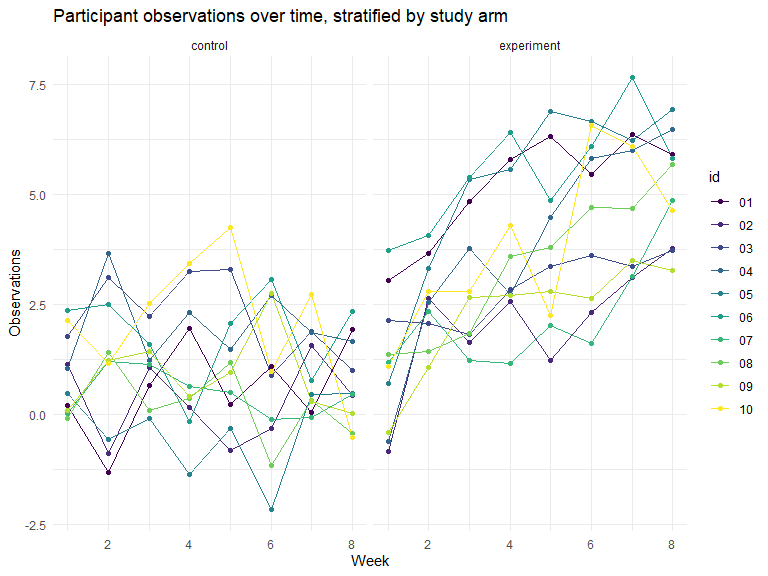
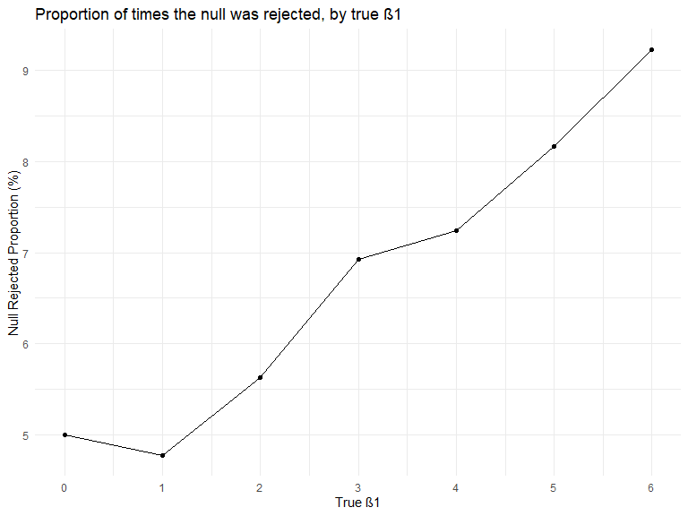
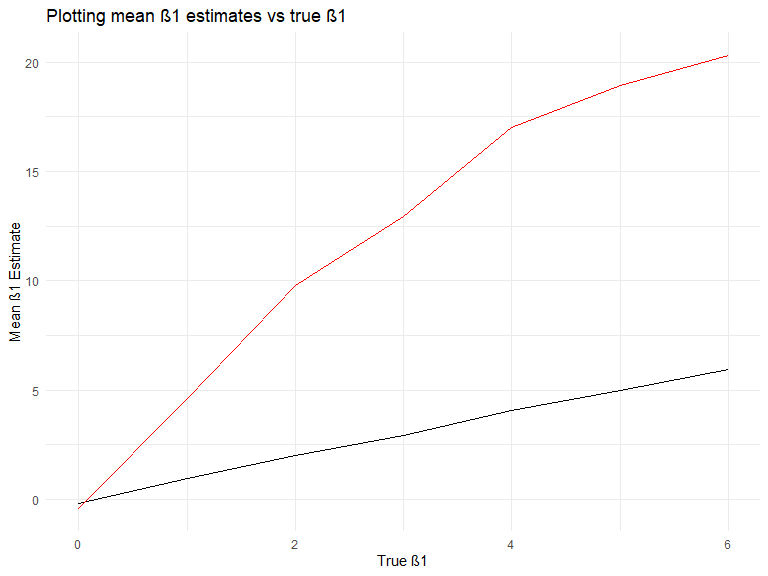

p8105\_hw5\_kpc2124
================
Kristi Chau
11/1/2019


## Problem 1 - iris dataset

Write a function that takes a vector as an argument; replaces missing
values using the rules defined; and returns the resulting vector. Apply
this function to the columns of iris\_with\_missing using a map
statement.

``` r
set.seed(10)

iris_with_missing = iris %>% 
  map_df(~replace(.x, sample(1:150, 20), NA)) %>%
  mutate(Species = as.character(Species))
```

Rules:

  - For numeric variables, you should fill in missing values with the
    mean of non-missing values

  - For character variables, you should fill in missing values with
    “virginica”

<!-- end list -->

``` r
iris_na = function(c) {
  ## if the column contains numeric variables, replace NAs with the row mean
  if (is.numeric(c)) {
    replace_na(c, round(mean(c, na.rm = TRUE),2))
  }
  ## if the column contains character variables, replace NAs with virginica
  else if (is.character(c)) {
    replace_na(c, "virginica")
  }
}

## mapping the function to the iris_with_missing
iris_full = 
  map(iris_with_missing,iris_na) %>% 
  bind_cols()

## using skimr, checked for missing values after applying function
iris_full %>% 
  skimr::skim()
```

    ## Skim summary statistics
    ##  n obs: 150 
    ##  n variables: 5 
    ## 
    ## -- Variable type:character ---------------------------------------------------------
    ##  variable missing complete   n min max empty n_unique
    ##   Species       0      150 150   6  10     0        3
    ## 
    ## -- Variable type:numeric -----------------------------------------------------------
    ##      variable missing complete   n mean   sd  p0  p25  p50  p75 p100
    ##  Petal.Length       0      150 150 3.77 1.6  1   1.7  4    4.97  6.9
    ##   Petal.Width       0      150 150 1.19 0.72 0.1 0.4  1.2  1.8   2.5
    ##  Sepal.Length       0      150 150 5.82 0.78 4.3 5.12 5.82 6.38  7.9
    ##   Sepal.Width       0      150 150 3.08 0.4  2   2.82 3.08 3.27  4.4
    ##      hist
    ##  <U+2587><U+2581><U+2581><U+2586><U+2586><U+2586><U+2583><U+2581>
    ##  <U+2587><U+2581><U+2581><U+2587><U+2583><U+2583><U+2582><U+2582>
    ##  <U+2582><U+2586><U+2583><U+2587><U+2583><U+2583><U+2581><U+2581>
    ##  <U+2581><U+2582><U+2583><U+2587><U+2582><U+2582><U+2581><U+2581>

**A quick `skimr` review shows that after applying the function to
replace missing values, there are no missing values in the dataset.**

## Problem 2 - longitudinal study

Create a tidy dataframe containing data from all participants, including
the subject ID, arm, and observations over time.

``` r
## creating a function to read the data
read_data = function(filename) {
  read.csv(str_c("./data/",filename))
}

long_study = 
  ## Start with a dataframe containing all file names; the list.files function will help.
  list.files(path = "./data", pattern = '*.csv') %>% 
  tibble(file_names = .) %>% 
  ## Iterate over file names and read in data for each subject using `purrr::map` and saving the result as a new variable in the dataframe.
  mutate(
    output_list = map(.x = file_names, ~read_data(filename = .x)),
    output_df = map(output_list,bind_rows)
  ) %>% 
  select(-output_list) %>% 
  unnest(output_df)
```

Tidy the result; manipulate file names to include control arm and
subject ID, make sure weekly observations are “tidy”, and do any other
tidying that’s necessary.

``` r
long_study = 
long_study %>% 
  ## separating file_names into abbreviated arm and id
  separate(file_names, into = c("arm","id"), sep = "_") %>% 
  mutate(
    ## unabbreviating arm
    arm = case_when(
      arm == "con" ~ "control",
      arm == "exp" ~ "experiment"
    ),
    ## removing '.csv' from id
    id = str_remove(id,".csv")
  ) %>% 
  ## just in case: rounding all datapoints to 2 decimal places
  mutate_if(is.numeric, round, digits = 2)
```

Make a spaghetti plot showing observations on each subject over time,
and comment on differences between groups.

``` r
spag_plot = 
long_study %>% 
  ## pivotting longer to create week and observation variables for each participant
  pivot_longer(
    week_1:week_8,
    names_to = "week",
    values_to = "obs"
  ) %>% 
  ## tidying 'week' data
  mutate(
    week = str_remove(week,"week_"),
    week = as.numeric(week)
  ) %>% 
  ## creating 2 panel spaghetti plot, x = week, y = observations
  ggplot(aes(x = week, y = obs, color = id)) +
  geom_line() + geom_point() +
  facet_grid(~arm) +
  labs(
    x = "Week",
    y = "Observations",
    title = "Participant observations over time, stratified by study arm"
  )

spag_plot
```



**Although observations for each participant in the control group appear
to fluctuate over time, if we look observations at week 1 and week 8, it
looks as though observations remain fairly constant over the study
period.**

**In comparison, observations for participants in the experimental group
appear to increase over the study period. Although we have no idea what
this data represents, observations between the experimental and control
groups appear to differ significantly, which could mean that the
exposure the experimental group received is having a significant effect
on the outcome of interest.**

## Problem 3 - exploring power

Generate 10000 datasets from the model: yi=β0+β1xi1+ϵi, with
ϵi∼N\[0,σ2\].

For each dataset, save β^1 and the p-value arising from a test of H:β1=0
using α=0.05. Hint: to obtain the estimate and p-value, use broom::tidy
to clean the output of lm.

``` r
set.seed(1)

## writing the simulation function
sim_regression = function(beta1) {
  ## fixing variables
  sim_data = tibble(
    n = 30,
    x_1i = rnorm(n,0,1), 
    beta0 = 2, 
    sigma2 = 50,
    y = beta0 + beta1 * x_1i + rnorm(n,0,sigma2)
  )
  
  ## linear regression model
  ls_fit = lm(y~x_1i, data = sim_data)
  
  ls_fit %>% 
  broom::tidy() %>% 
    filter(term == "x_1i") %>% 
    ## pulling β1 estimate and p-value
    select(estimate, p.value)
}
```

For β1 =
{1,2,3,4,5,6}

``` r
## running the simulation function over a couple β1 values, including β1 = 0
sim_results = 
  ## creating a dataframe for β1 values
  tibble(
    betas = c(0,1,2,3,4,5,6)
    ) %>% 
  ## map the function to these β1 values, and then bind rows of that output
  mutate(
    output_list = map(.x = betas, ~ rerun(10000, sim_regression(beta1 = .x))),
    output_df = map(output_list,bind_rows)
  ) %>% 
  select(-output_list) %>% 
  unnest(output_df)
```

Complete the following:

Make a plot showing the proportion of times the null was rejected (the
power of the test) on the y axis and the true value of β1 on the x axis.
Describe the association between effect size and power.

``` r
sim_results %>%
  ## group by betas to get the proportion for each beta
  group_by(betas) %>% 
  mutate(
    ## binary variable: 1 = p < α or null is rejected, 0 = p >= α, or fail to reject
    reject = case_when(
      p.value < 0.05 ~ 1,
      p.value >= 0.05 ~ 0
    ),
    ## get proportion by taking the mean of the binary variable and multiplying by 100
    per_reject = mean(reject) * 100
  ) %>% 
  distinct(betas,per_reject) %>% 
  ungroup() %>% 
  ggplot(aes(x = betas, y = per_reject)) +
  geom_point() +
  geom_line() +
  labs(
    x = "True β1",
    y = "Null Rejected Proportion (%)",
    title = "Proportion of times the null was rejected, by true β1"
  ) +
  scale_x_continuous(labels = c(0,1,2,3,4,5,6), breaks = c(0,1,2,3,4,5,6))
```



**For the most part, there appears to be an overall positive association
between effect size and power, that is, as effect size increases, the
power of the test increases.**

Make a plot showing the average estimate of β^1 on the y axis and the
true value of β1 on the x axis. Make a second plot (or overlay on the
first) the average estimate of β^1 only in samples for which the null
was rejected on the y axis and the true value of β1 on the x axis. Is
the sample average of β^1 across tests for which the null is rejected
approximately equal to the true value of β1? Why or why not?

``` r
sim_results %>% 
  ## group by betas to get the corresponding mean β1 estimates
  group_by(betas) %>% 
  mutate(
    ## get overall mean β1 estimates
    mean_b1hat = mean(estimate)
  ) %>% 
  ## filter by null rejected
  filter(p.value < 0.05) %>% 
  mutate(
    ## get mean β1 estimates for sample when null is rejected
    mean_b1hat_rej = mean(estimate)
  ) %>% 
  distinct(betas,mean_b1hat,mean_b1hat_rej) %>% 
  ungroup() %>% 
  ggplot(aes(x = betas, y = mean_b1hat)) +
  geom_line() +
  geom_line(aes(x = betas, y = mean_b1hat_rej),color = "red") +
  labs(
    x = "True β1",
    y = "Mean β1 Estimate",
    title = "Plotting mean β1 estimates vs true β1"
  )
```



**The sample average of the β1 estimate across tests for which the null
is rejected is not equal to the true value of β1. The black line
represents the overall mean of the β1 estimate vs the true β1. We see
that there is a linear association between the mean β1 estimate and the
true β1 and that the slope is about 1, which means that the mean β1
estimate across tests is approximately equal to the true β1.**

**In contrast, the red line represents the mean β1 estimate only for
samples when the null is rejected vs the true β1. We see here that while
there is a positive association, ghe slope is much greater than 1, which
means that for every 1 unit increase in true β1, there is a much greater
increase in the mean β1 estimate and therefore, this mean β1 estimate is
not equal to the true β1.**

**As we saw in the plot before, the null is rejected more frequently and
power increases as β1 increases. In addition, the null is rejected when
the β1 estimate is significantly different from the true β1. So, as true
β1 increases, the null is rejected more often and the β1 estimates when
the null is rejected are significantly different from the true β1.
Therefore, the mean β1 estimate is not equal to the true β1 when the
null (β1 = 0) isn’t true.**
